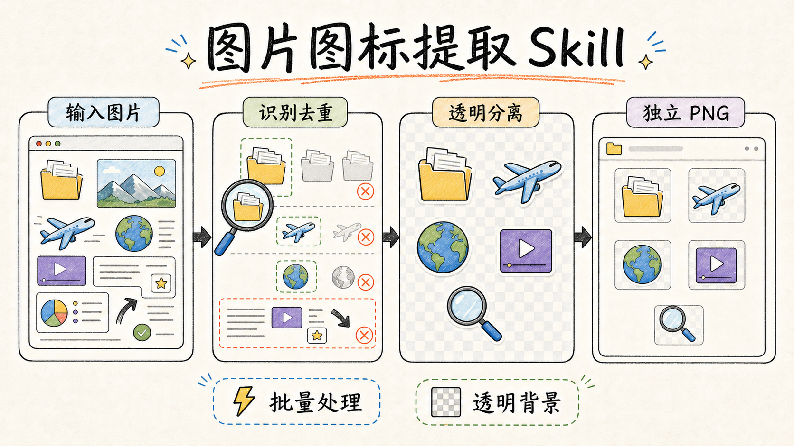
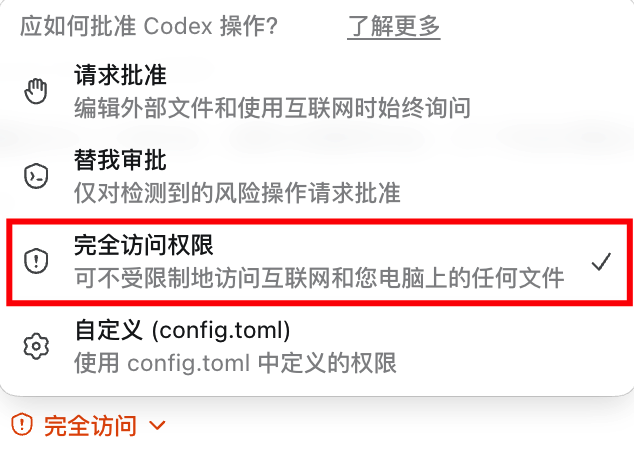
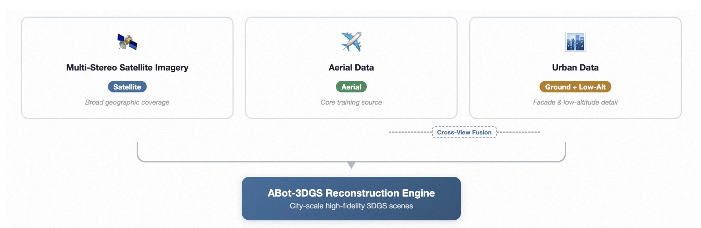
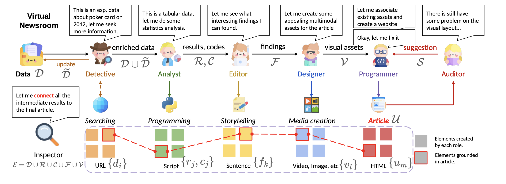

# Extract Image Icons Skill

[](README_en.md) [](https://github.com/wanghai673/extract-image-icons-skill/actions/workflows/ci.yml) [](https://github.com/wanghai673/extract-image-icons-skill/stargazers) [](https://github.com/wanghai673/extract-image-icons-skill/forks)



一个用于从截图、幻灯片、海报、流程图、仪表盘和其他合成图片中提取可复用视觉元素的 Skill。它会先盘点并去重图标，再通过源图引导的 `gpt-image-2` 编辑生成稀疏资产表，最后确定性地去除纯色背景、拆分并导出带语义文件名的透明 PNG。

它适合提取图标、徽章、Logo、吉祥物、贴纸、人物插画和其他独立视觉对象，让散落在一张大图中的素材变成可以单独移动、排版和复用的透明图片资产。

> [!IMPORTANT]
> **建议在 Codex 中使用“完全访问权限”运行本 Skill。**
>
> 提取过程会读取源图、创建任务目录、调用图片生成/编辑接口，并写入多张中间资产表和最终 PNG。“请求批准”模式可能频繁打断批量生成和本地处理。
>
> 图片后端默认优先读取 `~/.codex/auth.json` 中的 Codex OAuth；不可用时可使用 `OPENAI_API_KEY`、可选的 `OPENAI_BASE_URL` 和 Python `openai` 包。不要把 API Key 写入项目、Skill 或提取结果目录。
>
> 

> [!WARNING]
> 本 Skill 使用生成式图片编辑完成源图引导的图标分离，不是传统意义上的无损裁切工具。
>
> 低分辨率、被遮挡或细节模糊的图标可能出现重绘差异。工作流要求把每个成品与源图逐项对比；当轮廓、姿态、颜色、配件、内部结构或辨识性细节发生变化时，必须重试或明确记录警告，不得把结果报告为严格忠实。

> [!TIP]
> 本 Skill 不负责 OCR 文字提取，也不把普通箭头、连接线、卡片边框、色块和其他简单布局元素当作图标。如果只需要裁出一个边界清晰、背景简单的单独物体，普通抠图工具通常更轻量。

## 提取效果示例

<table>
  <tr>
    <th>原图</th>
    <th>透明资产表</th>
  </tr>
  <tr>
    <td></td>
    <td></td>
  </tr>
</table>

<table>
  <tr>
    <th>原图</th>
    <th>透明资产表（角色）</th>
    <th>透明资产表（工具）</th>
  </tr>
  <tr>
    <td></td>
    <td></td>
    <td></td>
  </tr>
</table>

## 特点

- 提取前建立完整图标清单，明确哪些部分应该作为一个整体移动。
- 排除可编辑文字、面板、普通箭头、连接线、边框和简单布局图形。
- 只对视觉上完全相同的重复图标去重，保留不同姿态、颜色和状态。
- 每张资产表硬限制为最多 9 个图标，复杂素材可以主动降低批次容量。
- 多张资产表可并发生成，减少大批量提取的等待时间。
- 使用与主体颜色距离较远的纯色键控背景，再确定性转换为透明通道。
- 先按组件发现顺序拆分，再人工核对语义映射，避免文件名与图标错配。
- 验证数量、名称、PNG/RGBA、透明度、方形画布、最小尺寸和边缘裁切。
- 保留 inventory、实际图片任务、资产表、拆分 manifest 和验证报告，便于复查与重试。

## 适用场景

- 从产品截图、网页截图或仪表盘中提取图标和插画。
- 从流程图、架构图或论文配图中分离角色、设备和概念图标。
- 从海报、信息图或幻灯片中导出可复用的徽章、贴纸和吉祥物。
- 对同一张图里的重复图标去重，只交付唯一资产。
- 把低分辨率视觉对象保守放大，并记录可能存在的重绘风险。
- 为 PPT、网页、设计稿或素材库准备透明背景 PNG。

## 运行要求

- Python 3.10+
- Pillow
- 支持图片编辑的 `gpt-image-2` 后端
- 图片后端认证任选其一：
  - 已登录 Codex，且本机存在 `~/.codex/auth.json`
  - `OPENAI_API_KEY`（可选 `OPENAI_BASE_URL`）和 Python `openai` 包

首次运行前执行环境自检：

```bash
python skills/extract-image-icons/scripts/generate_icon_sheets.py --doctor
python skills/extract-image-icons/scripts/process_icon_sheet.py --self-test
```

缺少通用依赖时可安装：

```bash
python -m pip install pillow openai
```

## 图片 Backend 与 API 配置

`generate_icon_sheets.py` 会自动选择图片后端：

1. 优先使用 `~/.codex/auth.json` 中的 Codex OAuth。
2. Codex OAuth 不可用时，读取 `OPENAI_API_KEY`。
3. 如配置 `OPENAI_BASE_URL`，则使用对应的 OpenAI-compatible 服务。

通常不需要手动指定后端。只有以下情况需要配置 API fallback：

- 当前环境没有可用的 Codex OAuth。
- 用户明确要求使用 OpenAI-compatible 中转服务。
- `--doctor` 报告 Codex OAuth 与 API Key 都不可用。

凭据只应保存在用户环境或用户级配置中，不要提交到 GitHub，也不要写入 inventory、图片任务或运行目录。

## 已知问题

- 生成式分离可能改变低分辨率图标的细节、线条、光影或比例，不能保证 100% 像素复刻。
- 组件检测器只理解像素连通关系，不理解语义；分离部件或相邻图标可能需要调整合并参数或重新生成。
- 如果键控背景颜色与主体颜色接近，透明化可能损伤边缘，需要更换 key color 后重试。
- 结构验证只能证明文件数量、格式、透明度和裁切等技术条件，不等同于视觉忠实度验证。
- 图片编辑调用会消耗模型额度；图标数量越多、重试次数越多，耗时和额度消耗越高。

## 安装

在 Codex 中输入：

```text
安装 extract-image-icons 这个 skill，地址是 https://github.com/wanghai673/extract-image-icons-skill
```

也可以手动把 `skills/extract-image-icons` 复制到 `${CODEX_HOME:-~/.codex}/skills/`。

## 更新

在 Codex 中输入：

```text
更新 extract-image-icons 这个 skill，地址是 https://github.com/wanghai673/extract-image-icons-skill
```

## 使用方式

在支持显式选择 Skill 的 Agent 中使用对应语法；Codex 中可以使用 `$extract-image-icons`：

```text
$extract-image-icons 把这张图片里的图标提取成透明 PNG。
$extract-image-icons 提取这个流程图中的人物和工具图标，并去重。
$extract-image-icons 把这组截图里的可复用视觉元素分别导出。
```

Skill 通常会完成以下步骤：

1. 检查图片生成认证、Pillow 和本地处理脚本。
2. 检查完整源图，盘点所有非文字前景视觉对象。
3. 写入 `icon_inventory.json`，记录语义名称、组合规则和忠实度要求。
4. 把图标分配到每批不超过 9 个的资产表任务。
5. 以原图作为编辑输入，通过 `gpt-image-2` 并发生成纯色背景资产表。
6. 去除键控背景，发现组件并核对实际顺序。
7. 使用语义名称重新拆分为透明 PNG。
8. 逐项对照源图做视觉检查，再运行确定性结构验证。

## 输出结构

每次提取应使用独立运行目录：

```text
run-dir/
├── icon_inventory.json              # 唯一资产清单和源图决策
├── batch_plan.json                   # 批次、布局和并发计划
├── image-jobs.jsonl                  # 实际提交给图片后端的任务
├── generated/                        # 纯色背景资产表
│   ├── batch_001.png
│   └── batch_002.png
├── intermediates/                    # 去除键控色后的透明资产表
├── raw/                              # 未命名的组件切分结果
├── icons/                            # 最终语义命名的透明 PNG
├── manifests/                        # 原始与命名拆分记录
└── icons_validation.json             # 确定性结构验证报告
```

交付时应报告输出目录、唯一图标数量、资产表数量、验证结果，以及所有视觉忠实度警告。

## 边界

- 本 Skill 面向复用型视觉对象提取，不负责识别或导出正文文字。
- 普通箭头、连接线、边框、卡片、色块和简单布局图形默认不作为资产。
- 可读文字默认从图标中移除；只有不可分离的品牌标记可以保留。
- 被遮挡或缺失的细节不得凭空补全；源图证据不足时应保持中性，而不是发明特征。
- 生成结果出现替换、漏图、粘连、姿态变化或明显风格漂移时，必须重新生成。
- 最终数量必须与 inventory 中的唯一资产数量一致。
- 确定性验证通过不代表语义或视觉忠实度通过，人工视觉检查不可省略。

## 仓库结构

```text
.
├── .github/                              # GitHub 工作流和 PR 模板
├── assets/                               # README 的真实提取效果示例
├── skills/
│   └── extract-image-icons/              # 可安装的 Skill 包
│       ├── SKILL.md                      # Skill 入口与完整工作流
│       ├── agents/openai.yaml            # Codex UI 展示元数据
│       ├── references/                   # Inventory schema 与 QA 规范
│       └── scripts/                      # 规划、生成、拆分和验证脚本
├── AGENTS.md                             # 仓库级协作规则
├── CHANGELOG.md                          # 用户可见变更记录
├── LICENSE                               # MIT License
├── README.md                             # 中文说明文档
└── README_en.md                          # 英文说明文档
```

## Star History

[](https://www.star-history.com/#wanghai673/extract-image-icons-skill&Date)

## 许可证

MIT
